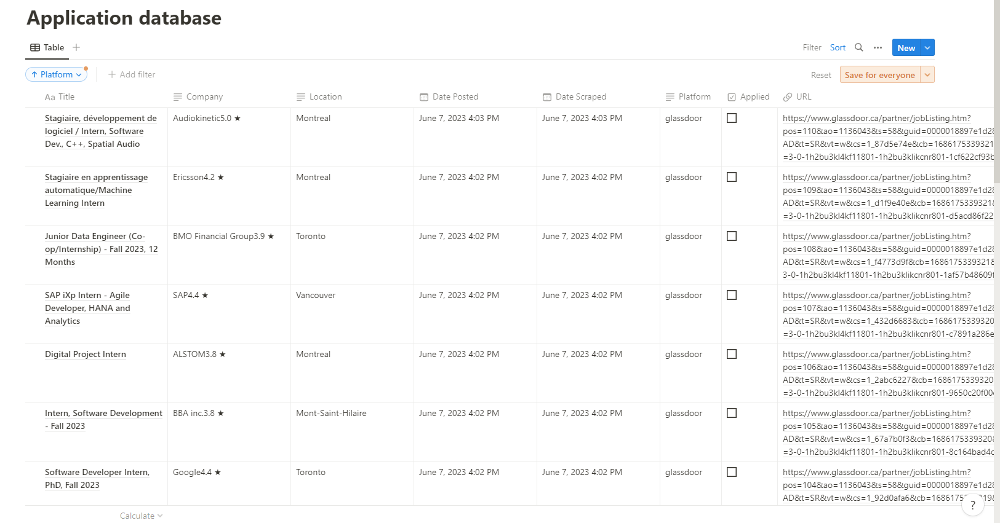

# Scrape_to_notion
Automatically scrapes jobs from multiple sites and adds them to a Notion database using Notion API and requests.

<!-- display img from folder -->



# Installing
```
pip install -r requirements.txt
```

```
Fill in your Notion API key and database ID in the config.py file
```
# Usage
```
python main.py
```


# Data visualization
#### coming soon...